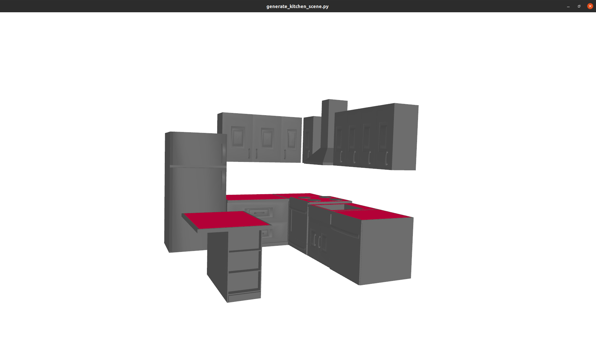
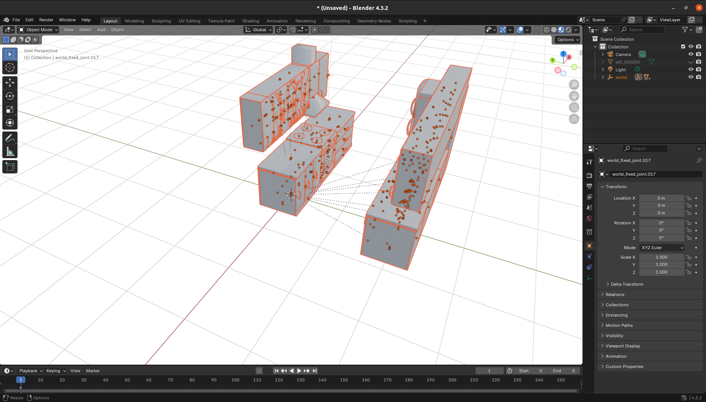

# Scene Synthesizer

A python package to generate manipulation scenes.

## Installation Requirement

This is tested on ubuntu 20.04 and cuda 12.1 with python3.10. 

### Via pip
```
pip3 install scene-synthesizer[recommend]
```

### Via git
Create and activate a virtual environment:
```
git clone https://github.com/ArghyaChatterjee/scene_synthesizer.git
cd scene_synthesizer/
python3.10 -m venv scene_synthesizer_venv
source scene_synthesizer_venv/bin/activate
pip3 install --upgrade pip setuptools
pip3 install -r requirements.txt
pip3 install -e.[recommend]
```
The function `show_graph` depends on `pygraphviz`. If required, install via
```
sudo apt-get install graphviz graphviz-dev
pip3 install pygraphviz
```
See the [documentation](https://scene-synthesizer.github.io/getting_started/install.html) for detailed installation instructions.

## Quick Start
Try out this example script to generate a kitchen scene and visualize it:
```python
cd scripts
python3 generate_kitchen_scene.py
```
Here is the output:

<p align="center">
    
</p>

Try out another example script to generate another kitchen scene and export as `.usd`:
```python
cd ../examples
python3 add_random_mdl_materials.py
```
The output `kit.usd` (universal scene descriptor) file will generate inside the `assets` folder. You can import it in blender and it will look like this:

<p align="center">
    
</p>

## Detailes Instruction
Here is an example to generate a scene:
```python
import scene_synthesizer as synth
import scene_synthesizer.procedural_assets as pa

# create procedural assets
table = synth.procedural_assets.TableAsset(width=1.2, depth=0.8, height=0.75)
cabinet = synth.procedural_assets.CabinetAsset(width=0.5, height=0.5, depth=0.4, compartment_mask=[[0], [1]], compartment_types=['drawer','drawer'])

# load asset from file
# Make sure to first download the file:
# wget https://raw.githubusercontent.com/clemense/kitchen-assets-cc-by/refs/heads/main/assets/chair/meshes/chair.{mtl,obj}
chair = synth.Asset('chair.obj', up=(0, 0, 1), front=(-1, 0, 0))

# create scene
scene = synth.Scene()

# add table to scene
scene.add_object(table)
# put cabinet next to table
scene.add_object(cabinet, connect_parent_anchor=('right', 'front', 'bottom'), connect_obj_anchor=('left', 'front', 'bottom'))
# put chair in front of table
scene.add_object(chair, connect_parent_id='table', connect_parent_anchor=('center', 'front', 'bottom'), connect_obj_anchor=('center', 'center', 'bottom'))

# randomly place plate and glass on top of table
scene.label_support('table_surface', obj_ids='table')
scene.place_object('plate', synth.procedural_assets.PlateAsset(), support_id='table_surface')
scene.place_object('glass', synth.procedural_assets.GlassAsset(), support_id='table_surface')

# preview scene in an opengl window
scene.show()

# export scene in various formats
scene.export('scene.usd')
scene.export('scene.urdf')
```

Check the [documentation](https://scene-synthesizer.github.io/) page for detailed installation instructions, API, and examples.

